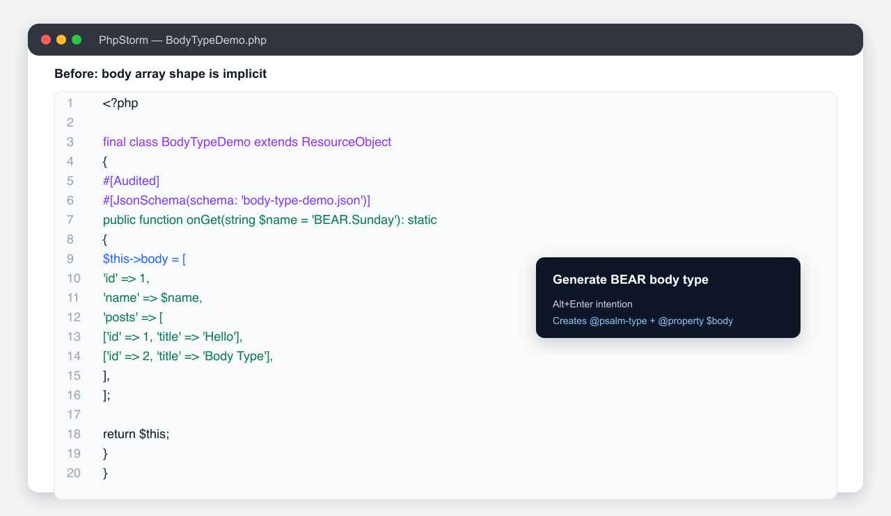
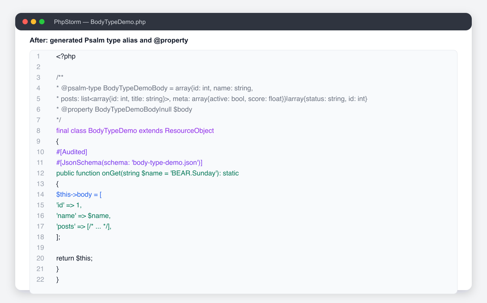

# BEAR.Sunday PhpStorm Plugin


## Links

* [JetBrains Marketplace](https://plugins.jetbrains.com/plugin/8030)

<!-- Plugin description -->
## Features

* BEAR.Resource URI completion
* BEAR.Resource goto from URIs such as `app://self/user` to `src/Resource/App/User.php`
* BEAR.Resource PHPDoc annotation completion
* BEAR.Resource JSON Schema goto
* Incoming Link/Embed relation gutter for BEAR.Resource methods
* Embedded template navigation for Twig and Qiq
* Extract BEAR.Resource parameters to Ray.InputQuery DTO
* Ray.Aop bound interceptor gutter icon and navigation from attributes such as `#[Transactional]`
* Ray.MediaQuery SQL goto
* Ray.QueryModule SQL goto
* Aura.Router goto BEAR.Resource
* Generate Psalm body type PHPDoc for BEAR.Resource body array shapes

<!-- Plugin description end -->
## Feature demos

The `demo-app` directory is a small BEAR.Sunday application that demonstrates every plugin feature.
Open `demo-app` in the sandbox IDE with `./gradlew runIde`, wait for indexing, and use Cmd/Ctrl-click,
completion, line markers, or the editor intention on the files below.

| Feature | Demo entry point | What to try |
| --- | --- | --- |
| BEAR.Resource URI completion | `demo-app/src/Resource/App/UriDemo.php` | Invoke completion inside `uri('...')` arguments. |
| BEAR.Resource goto | `demo-app/src/Resource/App/UriDemo.php`, `demo-app/src/Resource/App/Dashboard.php` | Cmd/Ctrl-click `app://self/user` or `/profile` to jump to the resource class. |
| BEAR.Resource PHPDoc annotation completion | `demo-app/src/Resource/App/DocblockAnnotationDemo.php` | Complete PHPDoc annotation names, annotation parameters, and URI-valued `href`/`src` fields. |
| BEAR.Resource JSON Schema goto | `demo-app/src/Resource/App/BodyTypeDemo.php` | Cmd/Ctrl-click `body-type-demo.json` to open `demo-app/var/json_schema/body-type-demo.json`. |
| Incoming Link/Embed relation gutter | `demo-app/src/Resource/App/User.php`, `demo-app/src/Resource/App/Profile.php` | Use the gutter to find incoming relations from `Dashboard.php`. |
| Embedded template navigation for Twig/Qiq | `demo-app/App/Dashboard.html.twig`, `demo-app/App/Dashboard.php` | Cmd/Ctrl-click or use the gutter on `user` / `$this->user` to jump to the embedded user template. |
| Extract BEAR.Resource parameters to Ray.InputQuery DTO | `demo-app/src/Resource/App/Point.php` | Run **Extract Input DTO...** on `onGet(int $x, int $y)` and compare with `PointDto.php` + `PointInput.php`. |
| Ray.Aop bound interceptor navigation | `demo-app/src/Resource/App/BodyTypeDemo.php` | Use the gutter/action on `#[Audited]` to jump to `AuditInterceptor.php`, bound in `AopDemoModule.php`. |
| Ray.MediaQuery SQL goto | `demo-app/src/Query/PointQueryInterface.php` | Cmd/Ctrl-click `point_distance` in `#[DbQuery(...)]` to open `demo-app/var/db/sql/point_distance.sql`. |
| Ray.QueryModule SQL goto | `demo-app/src/Query/LegacyPointQueryInterface.php` | Cmd/Ctrl-click `point_distance` in `@Query("point_distance")`. |
| Aura.Router goto BEAR.Resource | `demo-app/aura.route.php` | Cmd/Ctrl-click `/index` or `/dashboard` to jump to the matching Page resource. |
| Generate Psalm body type PHPDoc | `demo-app/src/Resource/App/BodyTypeDemo.php` | Run **Generate BEAR body type** on the resource class. |

### Body type generator screenshots

Before running the intention:



After generation:



## Requirements

* PhpStorm 2025.1 or later
* JDK 21 for building

## Libraries

* URI-Template Library (`com.damnhandy:handy-uri-templates:2.1.8`)
* Apache Commons Text (`org.apache.commons:commons-text:1.12.0`)

## Demo app

`demo-app/` is a small BEAR.Sunday application for trying this plugin's BEAR.Resource, Ray.InputQuery, and Ray.MediaQuery support in PhpStorm. It is a local demo fixture for the plugin, not a standalone package release.

## Build

```sh
./gradlew buildPlugin
```

## Run in sandbox PhpStorm

```sh
./gradlew runIde
```

## Test

```sh
./gradlew test
```

## License

MIT License. See [LICENSE](LICENSE).
