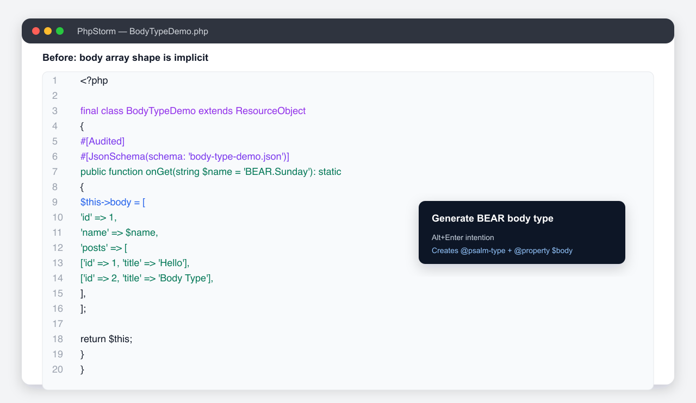
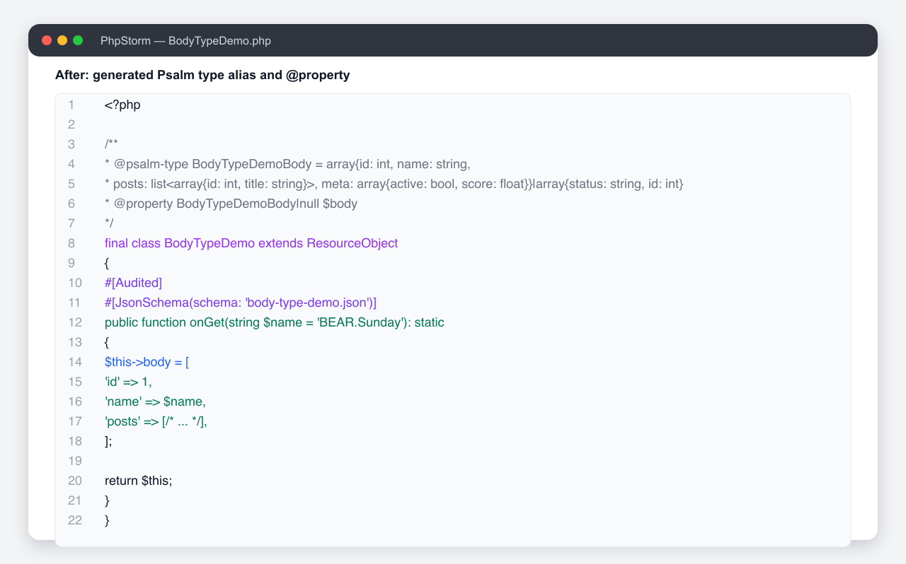
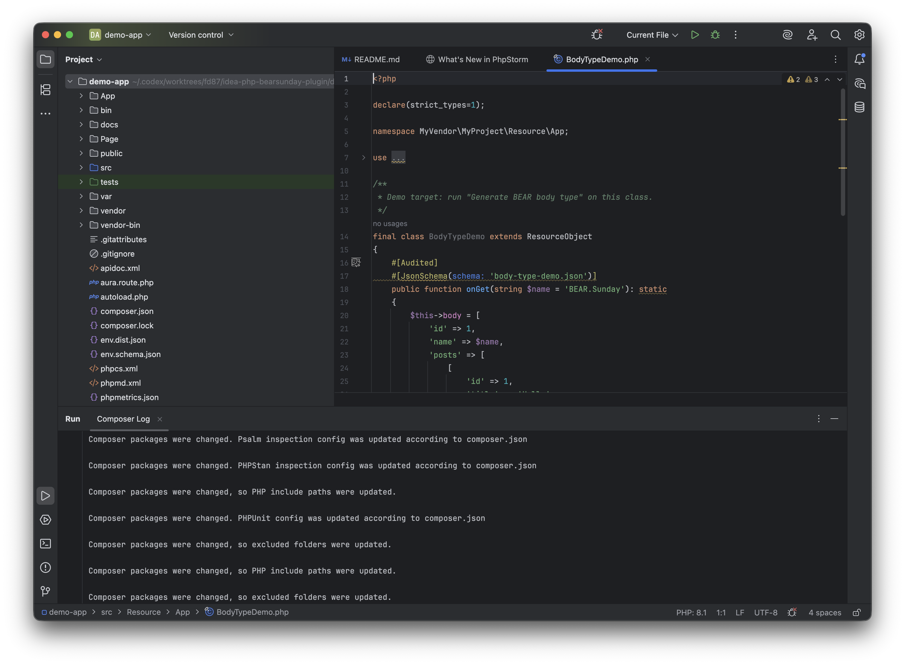

# BEAR.Sunday PhpStorm Plugin


## Links

* [JetBrains Marketplace](https://plugins.jetbrains.com/plugin/8030)

<!-- Plugin description -->
## Features

* BEAR.Resource URI completion
* BEAR.Resource goto from URIs such as `app://self/user` to `src/Resource/App/User.php`
* BEAR.Resource JSON Schema goto
* BEAR.Resource JSON Schema body key completion from `->body['<caret>']`
* Incoming Link/Embed relation gutter for BEAR.Resource methods
* `#[Embed]` template navigation: Cmd+click a Twig/Qiq variable to open the embedded template
* BEAR.Resource ↔ template navigation: jump between a resource class and its Twig/Qiq template from the context menu
* Extract BEAR.Resource parameters to Ray.InputQuery DTO
* Ray.Aop bound interceptor gutter icon and navigation from attributes such as `#[Transactional]`
* Ray.MediaQuery SQL goto
* Ray.QueryModule SQL goto
* Aura.Router goto BEAR.Resource
* Generate Psalm body type PHPDoc for BEAR.Resource body array shapes, including folder-level batch generation
* Generate JSON Schema files from BEAR.Resource body array shapes
* Infer concrete BEAR.Resource classes and method-specific body shapes from literal resource method calls
* Read-only MCP tools that let an AI agent ask the IDE about resource classes, the attributes they carry and the interceptors bound to them, the Ray.Di bindings the modules declare, `$this->body` shapes, JSON Schema files, the generated OpenAPI document and ALPS profiles, and compare what each of those three layers names

<!-- Plugin description end -->
## Feature demos

The `demo-app` directory is a small BEAR.Sunday application that demonstrates every plugin feature.
Open `demo-app` in the sandbox IDE with `./gradlew runIde`, wait for indexing, and use Cmd/Ctrl-click,
completion, line markers, or the editor intention on the files below.

| Feature | Demo entry point | What to try |
| --- | --- | --- |
| BEAR.Resource URI completion | `demo-app/src/Resource/App/UriDemo.php` | Invoke completion inside `uri('...')` arguments. |
| BEAR.Resource goto | `demo-app/src/Resource/App/UriDemo.php`, `demo-app/src/Resource/App/Dashboard.php` | Cmd/Ctrl-click `app://self/user` or `/profile` to jump to the resource class. |
| BEAR.Resource typed resource result | `demo-app/src/Resource/App/UriDemo.php`, `demo-app/src/Resource/App/User.php` | `get('app://self/user')` is inferred as the concrete `User` resource; `$user->body` is narrowed to the GET body shape, while `put()`/`post()` use their method-specific body shapes. |
| BEAR.Resource JSON Schema goto | `demo-app/src/Resource/App/BodyTypeDemo.php` | Cmd/Ctrl-click `body-type-demo.json` to open `demo-app/var/json_schema/body-type-demo.json`. |
| Incoming Link/Embed relation gutter | `demo-app/src/Resource/App/User.php`, `demo-app/src/Resource/App/Profile.php` | Use the gutter to find incoming relations from `Dashboard.php`. |
| Embedded template navigation for Twig/Qiq | `demo-app/App/Dashboard.html.twig`, `demo-app/App/Dashboard.php` | Cmd/Ctrl-click or use the gutter on `user` / `$this->user` to jump to the embedded user template. |
| Extract BEAR.Resource parameters to Ray.InputQuery DTO | `demo-app/src/Resource/App/Point.php` | Place the caret on `onGet(int $x, int $y)`, open the lightbulb, and run **Extract Input DTO...**. Compare with `PointDto.php` + `PointInput.php`. |
| Ray.Aop bound interceptor navigation | `demo-app/src/Resource/App/BodyTypeDemo.php` | Use the gutter/action on `#[Audited]` to jump to `AuditInterceptor.php`, bound in `AopDemoModule.php`. |
| Ray.MediaQuery SQL goto | `demo-app/src/Query/PointQueryInterface.php` | Cmd/Ctrl-click `point_distance` in `#[DbQuery(...)]` to open `demo-app/var/db/sql/point_distance.sql`. |
| Ray.QueryModule SQL goto | `demo-app/src/Query/LegacyPointQueryInterface.php` | Cmd/Ctrl-click `point_distance` in `@Query("point_distance")`. |
| Aura.Router goto BEAR.Resource | `demo-app/aura.route.php` | Cmd/Ctrl-click `/index` or `/dashboard` to jump to the matching Page resource. |
| Generate Psalm body type PHPDoc | `demo-app/src/Resource/App/BodyTypeDemo.php` or `demo-app/src/Resource/App/` | Run **Generate BEAR body type** on one resource class, or from the Project View folder popup to process every ResourceObject under the selected folder. |
| Generate body JSON Schema | `demo-app/src/Resource/App/BodyTypeDemo.php` | Run **Generate BEAR body JSON Schema**; it writes `var/json_schema/body-type-demo.json` without a method name in the file. |

### Body type generator output

Running **Generate BEAR body type** adds named Psalm array-shape aliases to the ResourceObject PHPDoc.
The GET body uses the conventional methodless name (`ArticleBody`), while other methods include the
HTTP method (`ArticlePostBody`, `ArticlePutBody`, ...). The `$body` property is declared as a union so
Psalm, PHPStan, and PhpStorm can narrow the shape by resource method.

```diff
 use BEAR\Resource\ResourceObject;

+/**
+ * @psalm-type ArticleBody = array{
+ *     id: int,
+ *     title: string,
+ *     tags: list<string>
+ * }
+ * @psalm-type ArticlePostBody = array{
+ *     status: string,
+ *     id: int
+ * }
+ * @property ArticleBody|ArticlePostBody|null $body
+ */
 final class Article extends ResourceObject
 {
     public function onGet(): static
```

Running **Generate BEAR body JSON Schema** uses the same inferred GET body shape and writes the
project's conventional methodless schema path, for example `var/json_schema/article.json`.

```diff
+{
+  "$schema": "https://json-schema.org/draft/2020-12/schema",
+  "type": "object",
+  "properties": {
+    "id": {
+      "type": "integer"
+    },
+    "title": {
+      "type": "string"
+    },
+    "tags": {
+      "type": "array",
+      "items": {
+        "type": "string"
+      }
+    }
+  },
+  "required": [
+    "id",
+    "title",
+    "tags"
+  ]
+}
```

### Body type generator screenshots

Before running the intention:



After generation:



Actual sandbox PhpStorm screenshot:



## MCP tools

The plugin registers a read-only toolset on the MCP server bundled with PhpStorm, so an AI agent can ask the
IDE for facts about the project instead of inferring them from a text search. Nothing the agent asks for
changes the project: the tools return facts, links and suggestions, and the agent writes any diff itself.

Enable the server under **Settings > Tools > MCP Server**, then connect your client from the same page
(Auto-Configure), or manually with the URL shown there:

```sh
claude mcp add --transport sse --scope user phpstorm http://127.0.0.1:<port>/sse
```

| Tool | Answers |
|---|---|
| `bear_resource_describe` | The class, `on*` methods with parameters and attributes, and the `#[Link]` / `#[Embed]` relations of a resource URI |
| `bear_resource_body_shape` | The Psalm shape a resource method assigns to `$this->body`, including unsaved editor changes |
| `bear_resource_attribute_index` | The PHP attributes each resource class and `on*` method carries under `src/Resource`, resolved through the file's `use` statements to the class they name, with the Ray.Aop interceptors bound to each by `annotatedWith()` |
| `bear_di_binding_lookup` | The Ray.Di bindings the modules under `src` declare: which implementation an interface is bound to, under which `annotatedWith()` qualifier, and the module file and line that binds it |
| `bear_schema_lookup` | The JSON Schema files of a resource, from the `#[JsonSchema]` attribute or the `var/json_schema` convention |
| `bear_apidoc_operation_lookup` | Operations in the OpenAPI document generated by bear/api-doc |
| `bear_alps_profile_read` | A whole ALPS profile, normalized the same way whether it is JSON or XML |
| `bear_alps_descriptor_lookup` | One ALPS descriptor by id or href |
| `bear_alps_transition_lookup` | ALPS transitions, with the `#[Link]` / `#[Embed]` declarations that implement them |
| `bear_alps_links_resolve` | Where an ALPS profile's links point, and whether the target exists |
| `bear_alps_links_suggest` | Links the project's conventions imply but the profile does not declare |
| `bear_contract_compare` | The field names the JSON Schema, the ALPS descriptor and the inferred body each carry, and which fields only one of them names |

The comparison is presence-only: it reports which side names a field, never whether the sides agree on its
type or meaning.

The attribute index matches by resolved class, not by text: the same short name aliases different classes in
different files. Its interceptor list covers `annotatedWith()` bindings only, so an empty list means no such
binding names the attribute, not that no interceptor runs on the method.

The binding lookup answers the question a text search cannot: an injected `#[Named('category')]
SurrogateKeyInterface` names neither the implementation class nor anything inside it, so grepping for either
misses the wiring entirely.

It reads every `bind()` chain under the root it is given, which defaults to `src` — **not** the whole project,
so a binding declared inside a framework package is only found when `moduleRoot` names that package's
directory. Within the root it collects every chain regardless of which application context installs it, so a
binding that another module later overrides is still listed.

Every binding says how Ray.Di gave it its target and how far this could follow that:

* `resolution: static` — the chain itself names the implementation class, which is `bind()->to()`.
* `resolution: dynamic-unresolved` — the implementation is decided when the application is built, not where
  the binding is written: `toProvider()` (a factory class produces it), `toConstructor()` (constructor
  arguments are wired by name), `toInstance()` (an object built on the spot), `toNull()` (a do-nothing
  stand-in), and an untargeted bind, which is `bind()` with no target at all and means Ray.Di builds the
  class itself. These say the tool does not name the implementation, not that none exists — the class their
  argument does name is reported under `targetClass`.

A binding a filter cannot be applied to, because the element being filtered is the one whose value the source
does not state (`annotatedWith($this->qualifier)`, or `annotatedWith("{$this->prefix}_dsn")`, where the source
holds a template and the name is whatever the property held), lands in `unresolved` with a `reason` instead of
being silently excluded. So do `rename()` calls, which move an existing binding to another qualifier or to
another interface: this version reports them rather than applying them.

Two Ray.Di constructs are not read at all, and the tool says so rather than answering as if they were absent:
`MultiBinder`, which collects several implementations of one interface, and `bindInterceptor()`, which weaves
Ray.Aop interceptors onto methods.

## Requirements

* PhpStorm 2025.2 or later (the MCP tools use the MCP server bundled from that release)
* JDK 21 for building

## Libraries

* URI-Template Library (`com.damnhandy:handy-uri-templates:2.1.8`)
* Apache Commons Text (`org.apache.commons:commons-text:1.12.0`)

## Demo app

`demo-app/` is a small BEAR.Sunday application for trying this plugin's BEAR.Resource, Ray.InputQuery, and Ray.MediaQuery support in PhpStorm. It is a local demo fixture for the plugin, not a standalone package release.

## Build

```sh
./gradlew buildPlugin
```

## Run in sandbox PhpStorm

```sh
./gradlew runIde
```

## Test

```sh
./gradlew test
```

## License

MIT License. See [LICENSE](LICENSE).
